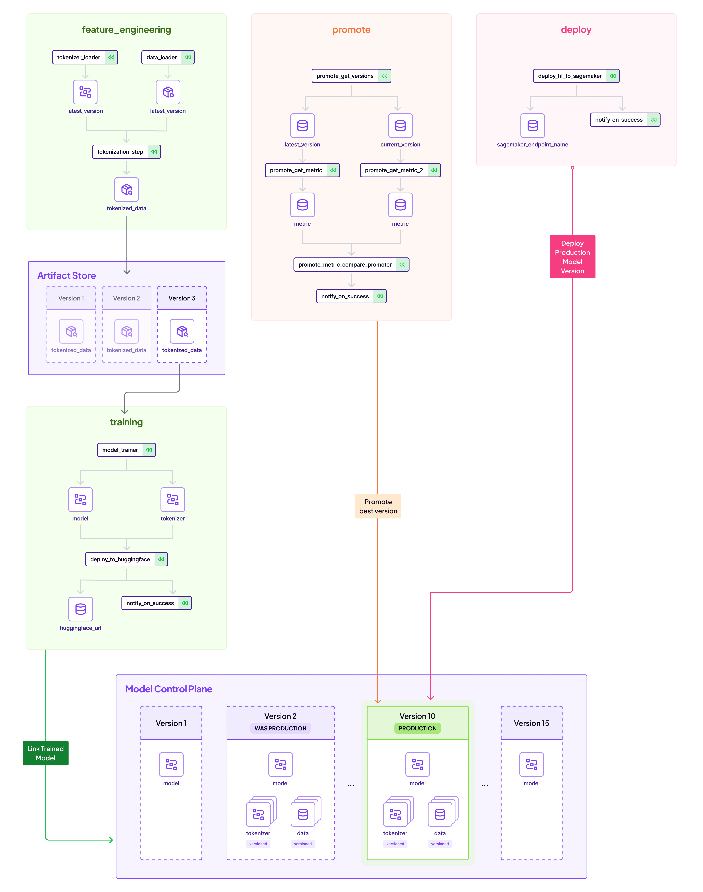

# Huggingface Model to Sagemaker Endpoint: Automating training and deployment with ZenML

While almost every Huggingface model can be easily deployed to AWS Sagemaker endpoints, it is often desirous to automate
this flow. This project showcases one way of using ZenML pipelines to achieve this:

- Train/Finetune a Sentiment Analysis NLP model and push to Huggingface Hub
- Promote this model from staging to production
- Deploy the model at the `Production` Stage to a Sagemaker endpoint

The above flow is achieved in a repeatable, fully tracked pipeline that is observable across the organization. Let's
see how this works.

## 👋 Get started

What to do first? You can start by giving the the project a quick run. The
project is ready to be used and can run as-is without any further code
changes! You can try it right away by installing ZenML, the needed
ZenML integration and then calling the CLI included in the project. We also
recommend that you start the ZenML UI locally to get a better sense of what
is going on under the hood:

```bash
# Set up a Python virtual environment, if you haven't already
python3 -m venv .venv
source .venv/bin/activate
# Install requirements & integrations
make setup
# Optionally, provision default local stack
make install-stack
```

This will open up the ZenML dashboard on your browser. The username should be `default` and password empty.

You should now register your huggingface token, which can be found in your [settings](https://huggingface.co/settings/tokens)
page, as a ZenML secret:

```shell
zenml secret create huggingface_creds --username=HUGGINGFACE_USERNAME --token=HUGGINGFACE_TOKEN
```

You also need to have your local AWS CLI configured to have Sagemaker endpoint access.

## A process overview

Here is an overview of the entire process:



There are three pipelines at play, which all use the ZenML Model Control Plane to communicate with each other.

* The training pipeline, which is responsible for training the model and pushing to Huggingface.
* The promotion pipeline, which is responsible for promoting the model to `Production` if it is better than the last best version.
* The deployment pipeline, which deploys the latest `Production` pipeline

Let's run these one by one:

## Train the model

Next, you should look at the CLI help to see what you can do with the project:
  
```shell
python run.py --help

python run.py --training-pipeline --num-epochs 1 --train-batch-size 128 --eval-batch-size 12
```

This will train a model from Huggingface and register a new ZenML model on the Model Control Plane:


Please note the above screens are a cloud-only feature in [ZenML Cloud](https://zenml.io/cloud), and
the CLI `zenml models list` should be used instead for OSS users.

At the end of the pipeline, the model will also be pushed the Huggingface, and a link estabilished between the ZenML Control Plane and the Huggingface model repository.


Notice the linkage of the revision made on Huggingface to the metadata tracked on the ZenML pipeline. This estabilishes lineage.

## Promote the model 

You can run the training pipeline a few times to produce many versions of the model. Feel free to edit the parameters accordingly.
When the time is right, you now run the promotion pipeline:

```shell
python run.py --help

python run.py --promoting-pipeline
```

This pipeline finds the best model from the last pipelines that were run, and promotes it to production. That simply means its marked as production in the Model Control Plane:


## Deploy the model

Finally, when the time is right, its time to deploy the latest `Production` model!

```shell
python run.py --deploying-pipeline
```

This uses the latest Huggingface revision, and deploys it on Sagemaker:

```shell
Creating model with name: huggingface-pytorch-inference-2023-11-08-10-33-02-272
Creating endpoint-config with name huggingface-pytorch-inference-2023-11-08-10-33-03-291
Creating endpoint with name huggingface-pytorch-inference-2023-11-08-10-33-03-291```
```

Verify that the endpoint is up:

```shell
aws sagemaker list-endpoints
```

You should see a deployed endpoint to sagemaker.

## Run the demo app

```shell
cd gradio
python app.py
```


The demo has two modes: `sagemaker` and `local`. If sagemaker is selected, the client pings ZenML, finds the latest Production model, and uses the associated sagemaker endpoint to make the prediction. Otherwise, it just downloads the model and runs it locally. Naturally, the Sagemaker endpoint will usually be faster!

And there you go, you have successfully trained and pushed a model to Huggingface, and deplyoed it to AWS Sagemaker, in a ZenML pipeline. Read more on the [ZenML docs](https://docs.zenml.io)